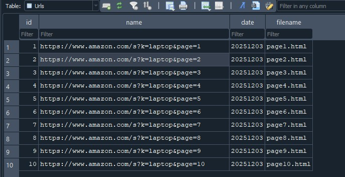
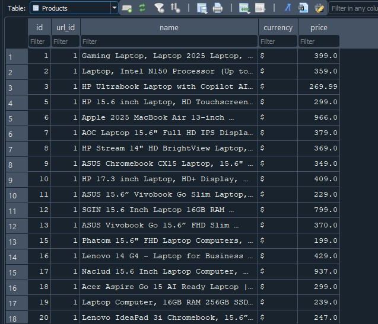
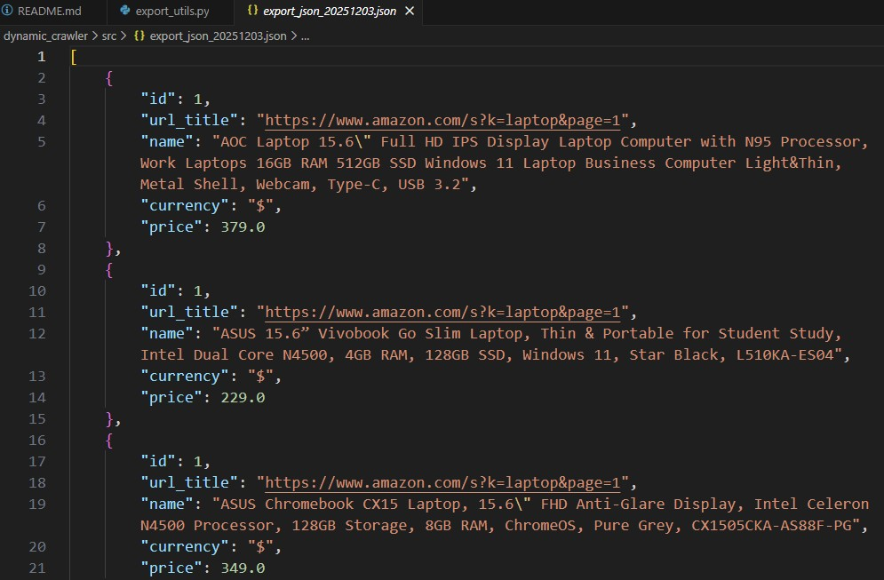
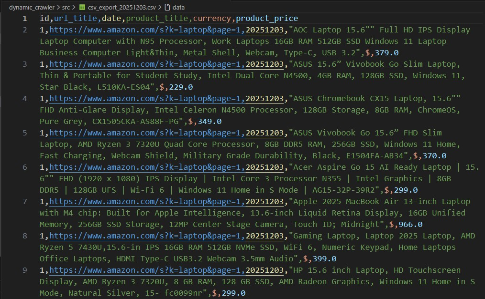

# Playwright-based Crawler & Product Analyzer

A **synchronous web crawler** built with Playwright, designed to fetch e-commerce search result pages, store them locally as HTML, and extract structured product information into a SQLite database.

**Note:** Currently configured for Amazon, but extensible via custom site adapters included in "specific_sites.py".

---

## Features

- **Playwright-based** dynamic crawler (desktop Chrome UA, stealth context and JavaScript capabilities).
- **Custom adapters included**: the crawler main loop is site-agnostic. Specific site adapters, for pagination and parsing, are included via specific_sites.py.
- **Config-driven:** loads settings from configurable config.json.
- **Local HTML saving:** stores each page as page.html for easier data extraction.
- **Persistent SQLite integration:** tracks URLs, timestamps, and filenames.
- **Stealth browser context:** spoofed languages, headers, viewport, user agent.
- **Product insertion module:** parses saved HTML, extracts product names/prices/currency and stores data in persistent database.
- **Export program included** to export SQLite database to JSON or CSV.

---

## How it works

- **Crawler_seed module:** builds pagination for each site, previous import of a custom class that encapsulates the URL generation and parsing logic for a specific e-commerce site. Loading the desired number of pages to crawl from config.json, the module inserts the properly formatted URLs into the DB for the crawler module.
- **Crawler_main module:** loads the sequence of e-commerce search result pages generated by *Crawler_seed*, visits them using Playwright and captures their fully rendered HTML. The data is then ready for product parsing and export.
- **Crawler_text module:** After having downloaded the HTML webpages with the crawler, *Crawler_text* reads them, extracts product information (title, price, currency) and inserts each product into the SQLite database.
- **Crawler_export:** exports results stored in DB to a JSON or CSV file.

--

## Result examples

## URLs table



*Shows the contents of the Urls table, where each discovered page is stored along with timestamps and filenames of its html file*.

## Example: Products table



*Displays the Products table built from exracting product-info (title, currency, and price) from scraped htmls*.

## Examples: JSON export file



*Shows an example of the JSON export. The file contains structured records for products correlated to their corresponding URLs*.

## Examples: CSV export file



*Shows the CSV export file generated from the SQLite database. Each row represents a crawled product with its scraped data.*

---

## Requirements

- Python 3.9+
- Playwright
- BeautifulSoup4

1. Install dependencies: `pip install beautifulsoup4 playwright`
2. To complete Playwright installation, run in terminal: `playwright install`.

---

## Configuration

- Example:

```json
{
    "site": "amazon",
    "database_path": "mini.sqlite",
    "pages_to_crawl: 4
}
```

- **site:** specifies which custom site config the selected module will use. Site name must be checked for reference in the *site_registry* function included in *specific_sites.py* script.
- **pages_to_crawl**: specifies how many pages will be generated by the crawler_seed module for future parsing.
- **database_path**: SQLite file name (placed inside /data).

---

## Usage

- Crawler usage example:

- **STEP 1:**

```Configure config.json values```.

(Check *specific_sites.py* for desired site name.)

- **STEP 2:**

```python crawler_seed.py```

- **STEP 3:**

```python crawler_main.py```

- **STEP 4:**

```python crawler_text.py```

- (Optional) **STEP 5:**

4. Export results to JSON (or CSV):

```python crawler_export.py```

---    

## Database schema

- **Urls:** id, crawled URLs, timestamps, store HTML files' titles.

- **Products:** scraped product data (title, currency, price)

---

## Logs

- crawler.log: general activity
- crawler_errors.log: errors during crawling

---

## License

This project is licensed under the MIT License – see the LICENSE file for details.

---

## Disclaimer 

This tool is for educational purposes only. Users are responsible for complying with the Terms of Service of any website they crawl, including every e-commerce website they should visit.

---

## Contributions & Issues

Feel free to open issues or pull requests.
For major changes, please open an issue first to discuss.

---

## Acknowledgements

- Uses BeautifulSoup and Playwright.

